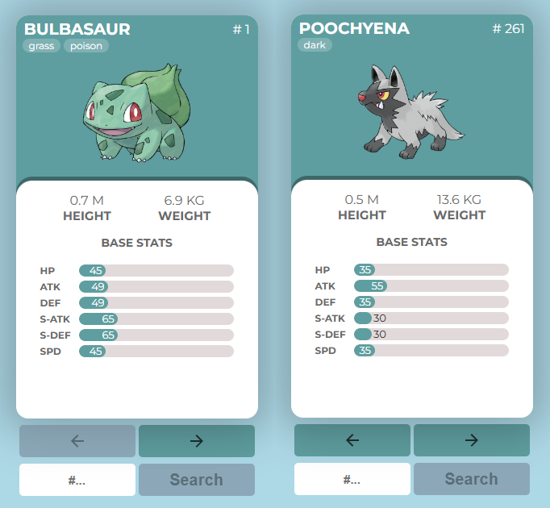

# PokeApi

This project is a practical example of using the Axios library to make HTTP requests in JavaScript. Additionally, Tanstack Query was implemented to cache previously made requests.



## Project Features

- **Vite:** A React project was created using Vite.

- **PokeAPI:** The PokeAPI was used as a service to fetch data.

- **Axios:** The Axios library was added to handle HTTP requests.

- **Tanstack Query:** Tanstack Query was used to perform asynchronous requests, cache previously fetched data, and manage "Pending" states to display a loading screen and "Success" states to render data.

- **Material UI:** The Material UI library was used to implement the loading screen and button icons.

- **Native CSS:** The remaining component styles were created using native CSS, including dynamic statistics bars.

## Usage

1. **Clone the repository**:
   ```sh
   git clone https://github.com/dominguesleo/pokeApi.git
   ```

2. Navigate to the project directory:
   ```sh
   cd pokeApi
   ```

3. Install the dependencies:
   ```sh
   npm install
   ```

4. Start the development server:
   ```sh
   npm run dev
   ```

5. Open your browser and go to:
   ```
   http://localhost:5173
   ```
